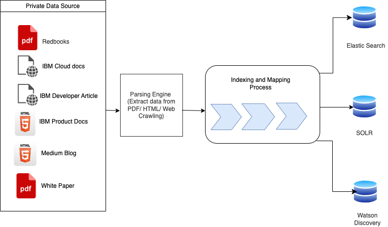

# Indexing Utilities for Enterprise LLM pipeline

This directory contains utilities designed for indexing operations, along with configuration management, and example scripts/notebooks for Elasticsearch and Solr.



## Description

The utilities in this directory serve two main purposes:

1. **Indexing Operations**: The `indexing.py` script provides a set of functions and tools that facilitate the indexing process, ensuring efficient and accurate search results.
   
2. **Configuration Management**: The `config.yaml` file allows users to easily manage and modify the settings related to indexing and other operational parameters.

## Re-usable Files in this Directory

- **`indexing.py`**: This script contains the primary functions and utilities for indexing.

- **`config.yaml`**: A configuration file in YAML format that provides a structured way to manage settings for the indexing process, including paths, parameters, and other operational details.

## Usage

### Using `indexing.py`:

1. Ensure you have all the necessary dependencies installed.
2. Import the required functions from the script:
   ```python
    indexName = cfg['indexName']
    es_client = create_elastic_instance(cfg['elasticURL'],cfg['elasticCertPath'])
    create_index(indexName,cfg['indexMapping'],es_client)
    file_list = get_all_files(cfg['indexFileFolderPath'])
    for file in file_list:
        indexing_document(indexName,file,es_client)
   ```

### Using `config.yaml`:

1. Open the `config.yaml` file in any text editor.
2. Modify the parameters corresponding to your document index as needed.
3. Save the file and ensure the utilities or scripts referencing this configuration file are updated accordingly.

## Examples of Indexing Documents with Elasticsearch or Solr

This directory also contains resources for indexing documents into Elasticsearch and Apache Solr. Both Elasticsearch and Solr are powerful, open-source search platforms that offer robust capabilities for handling and analyzing large datasets.


Image source: https://www.giffgaff.io/tech/elasticsearch-index-management

## Repository Contents

- [Elastic Search](../1.%20Indexing%20documents/Elastic%20Search/): A directory containing a Python notebook (`elasticsearch_indexer.ipynb`) that demonstrates how to index documents into Elasticsearch.
- [Solr](../1.%20Indexing%20documents/Solr/): A directory containing a Python script (`solr_indexing.py`) that shows how to index documents into Solr.

- Waston Discovery:  You can also index your documents in Watson Discovery by following the [documentation here](https://cloud.ibm.com/docs/discovery-data?topic=discovery-data-upload-data).

## Usage

The `elasticsearch_indexer.ipynb` notebook and the `solr_indexing.py` script both provide step-by-step guides on how to index documents into Elasticsearch and Solr respectively. This includes initializing a connection to an instance of the search platform, creating an index or collection, and adding documents to the index or collection.

## Dependencies

These resources require Python 3.6 or later. Additionally, the Elasticsearch notebook requires the `elasticsearch` Python library, and the Solr script requires the `pysolr` Python library.

You can install these libraries using pip:

```
pip install elasticsearch pysolr
```

Also, you need to have access to Elasticsearch and Solr instances to run the notebook and script.
