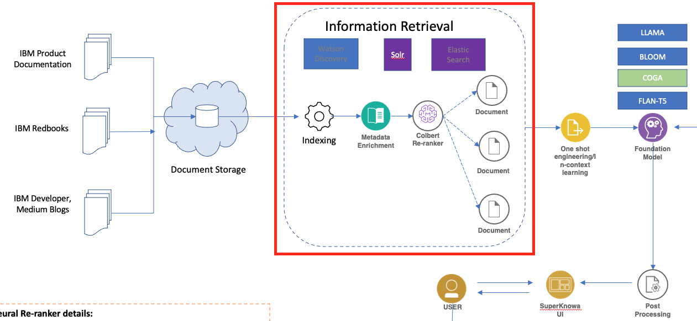

# Information Retriever for Retrieval Augmented Generation

This repository contains Python scripts demonstrating the use of a Neural Retriever in a Retrieval Augmented Generation (RAG) pipeline. The scripts demonstrate three different implementations of a Neural Retriever using Apache Solr, Elasticsearch, and Wikidata as document stores.


## Directory Contents

- [Elastic Search](../2.%20Neural%20Retriever/ElasticSearch/): Demonstrates the use of Elasticsearch as a document store for the neural retriever.
    - [es_retriever.ipynb](../2.%20Neural%20Retriever/ElasticSearch/elastic_retriever.ipynb)
- [Solr](../2.%20Neural%20Retriever/Solr/): Demonstrates the use of Apache Solr as a document store for the neural retriever.
    - [solr_retriever.ipynb](../2.%20Neural%20Retriever/Solr/solr_retriever.ipynb)
    - [solr_retriever](../2.%20Neural%20Retriever/Solr/solr_retriever.py)

- [Watson Discover](../2.%20Neural%20Retriever/Watson%20Discovery/): Demonstrates the use of Watson Discovery as a document store for the neural retriever.
    - [WD_PDF_Retriever](../2.%20Neural%20Retriever/Watson%20Discovery/WD_PDF_Retriever.py)
    - [WD_retriever.py](../2.%20Neural%20Retriever/Watson%20Discovery/WD_retriever.py)

- [ProcessElastic.py](./ProcessElastic.py): Re-usable Script to retrieve documents from elastic search instance.




## Getting Started

1. Clone this repository.
2. Install the required dependencies (see the Dependencies section below).
3. Modify the [config.yaml](../config.yaml) to update the `retriever` pointing to your service
4. Run the [ProcessElastic.py](./ProcessElastic.py) to see the neural retriever in action.

## Usage

Run the [ProcessElastic.py](./ProcessElastic.py) after updating [config.yaml](../config.yaml) to see the neural retriever in action.

### Example scripts and notebook

Each script defines a function for the information retriever (`SolrRetriever`, `ESRetriever`, or `WDRetriever`) takes a query and returns the top matching documents from the respective document store.

Here's a basic example of how you might use the `SolrRetriever`:

```python
retriever = SolrRetriever(solr_url='http://localhost:8983/solr', collection_name='my_collection')
results = retriever.retrieve('What is DataOps?')
print(results)
```

## Dependencies

These scripts require Python 3.6 or later. They also require the following Python libraries:

- `pysolr` (for `solr_retriever.py`)
- `elasticsearch` (for `es_retriever.ipynb`)
- `requests` (for `wd_retriever.py`)

You can install these libraries using pip:

```
pip install pysolr elasticsearch requests
```
